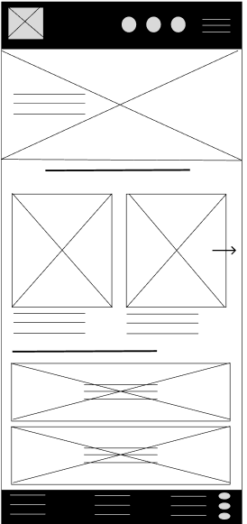
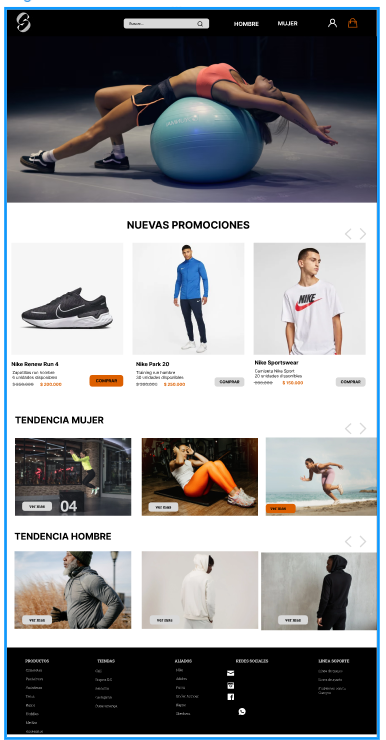

## trabajo-final-Sport-shop
# entregas
<h1> Proyecto final </h1>

 Este es un proyecto de iniciacion al diseño y desarrollo de una pagina web. En este trabajo se evidencia como se inicia desde un wireframe hasta la terminacion ya codificada de una pagina web, adicionalmente del desarrollo de la misma en un negocio real, donde evidenciamos la funcionalidad y ayuda que representa para el negocio.

 El proyecto final es una pagina web de una tienda de ropa deportiva realizada por Angelo Gonzalez y Cristian Beltran, idea del grupo apuntandole a solucionar el problema de muchas personas al querer ir a entrenar con  prendas comodas y de muy buenas marcas.. 

 El proyecto se realizo en el siguiente orden:
    1. Wireframe: Se realizo una idea inicial del Trabajo final con un plano que especificaba las ideas basicas y principales del proyecto.
    2. Mockup: la realizacion del Trabajo final ya conteniendo el diseño y una idea totalmente plasmada pero sin ningun tipo de funcionalidad todavia.
    3. Proyecto terminado (html y css) : la aplicacion de codigos tanto estructuralmente como en diseño y estilos para la terminacion del mismo.
    4. Se añaden algunas funciones basicas e JS

<h2> Diseños </h2>

 Aqui se encuentran todos los diseños realizados y pensados para el proyecto realizado:

https://www.figma.com/proto/mLIbwkYwi3b5nfgw93P2Rt/Untitled?node-id=0-1&t=VDUWzVRBiNsHQ93e-1

 Autoria Cristian David Beltran Gomez y Angelo Gonzalez 

